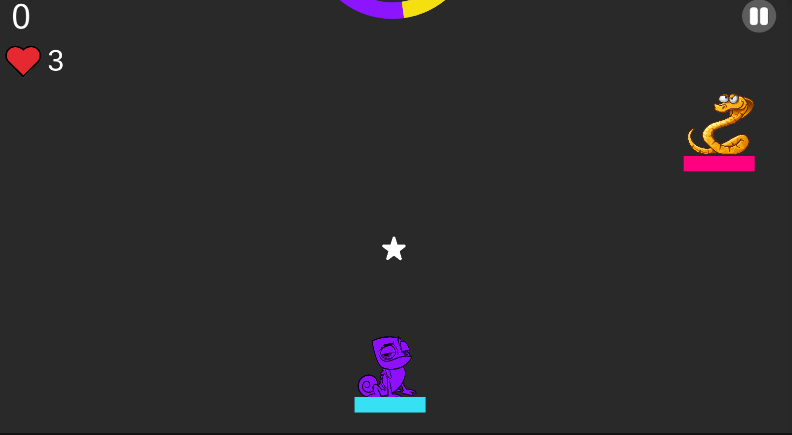
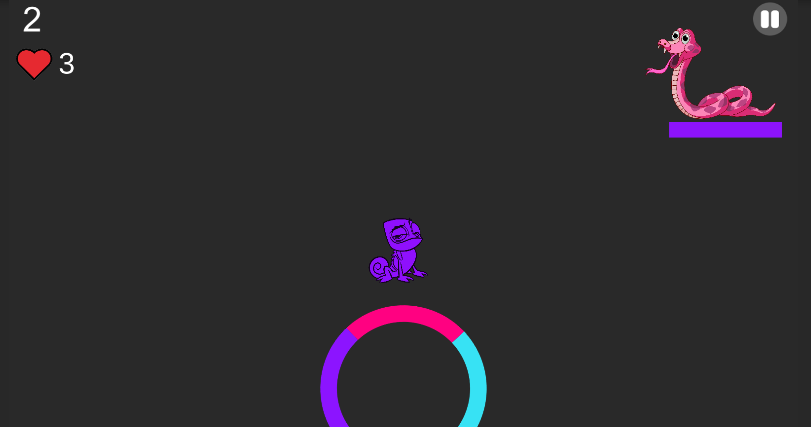
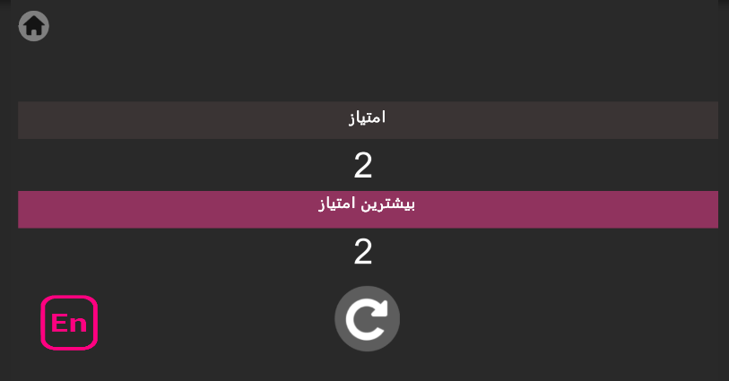

# Chameleon 👀🔥

The game starts with the presence of a chameleon named Hobbin. The main feature of chameleons is that
They are the same color as the environment, but Hobbin in this game has more features than a normal chameleon.

Hobbin is white at the beginning of the game and the reason why its primary color is white is that in color theory white is a combination of all colors. Three units of life are considered for Hobbin. Hobbin is in a mysterious way Which is full of colorful and various obstacles, there are colored points in this path and Habin can change his color only by hitting these points and cross the obstacles in his way, and if the obstacles are not the same color, one of his three lives decreases. As Hobin continues on his path, he sees stars in the game that Hobin earns points by hitting them.

And if the number of stars he has collected exceeds 100 stars, it will be given as a unit of life as an incentive. Also, Hobbin may encounter enemies along the way, and this is the way to deal with these enemies is That Habin shows his unique feature, which is the ability to shoot, and Habin can destroy these enemies by shooting bullets.

This game is inspired by color switch game in which the player crosses obstacles by changing the color, color switch is my main competitor in this area, but by adding different features to the game, I try to have more advantages than this game and a more attractive environment and Make it more fun.

## Game Design Document 
The GDD is written in Persian.(will be translated soon!!)

[View the GDD for more information ](GDD_MobinaKashanian.pdf)

## Language
The project is written in C#(Unity).

## Images
</img> 
</img> 
</img> 
</img> 

## Contributing
Pull requests are welcome. For major changes, please open an issue first to discuss what you would like to change.

Please make sure to update tests as appropriate.

## License
[ Apache-2.0 License](http://www.apache.org/licenses/)
